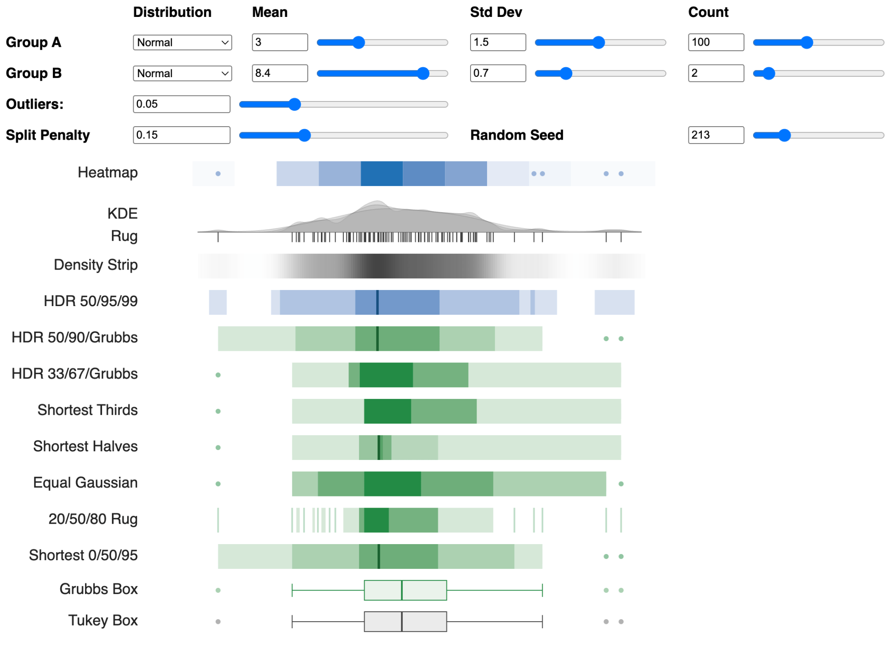

Workbench for experimenting with alternate data strip views,
where a data strip is a one-dimensional graphical summary of
a data distribution.

Alternative ideas presented:
* Grubbs's test for outlier thresholds
* asymetrical outlier thresholds
* variations on Shortest Half for densest regions
* Non-contiguous Shortest Half

Live web app at [github.io/data-strips](https://xangregg.github.io/data-strips/). 

Explanatory blog post at [Data Strips Experiment](https://rawdatastudies.com/2025/07/05/data-strips-experiment/).

